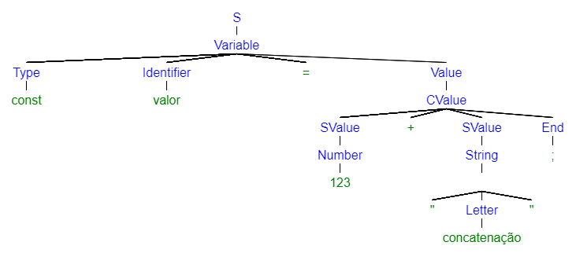
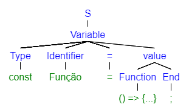
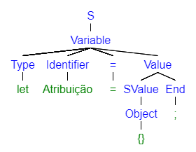
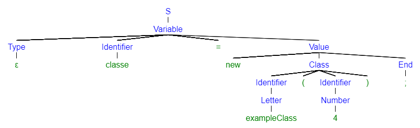
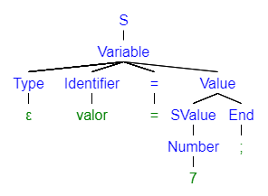

# atribuicao-javascript

Projeto da disciplina de Linguagem de Programação II, sobre os conceitos fundamentais de Linguagem de Programação.

## Exemplos de atribuição

```
  a = 1
  a = 1;
  a = 1.1
  a = 1.1;

  b = ''
  b = '';
  b = ""
  b = "";
  b = ``
  b = ``;

  b += '';

  c = []
  c = [];
  c = ['']
  c = [''];
  c = [""]
  c = [""];
  c = [``]
  c = [``];
  c = [{}]
  c = [{}];
  c = [() => {},]
  c = [() => {},];

  d = [][]
  d = [][];
  d = [2][2]
  d = [2][2];
  d = ['']['']
  d = [''][''];
  d = [""][""]
  d = [""][""];
  d = [``][``]
  d = [``][``];
  d = [{}][{}]
  d = [{}][{}];
  d = [() => {}][() => {}]
  d = [() => {}][() => {}];

  e = {}
  e = {};
  e = {a: 1,}
  e = {a: 1,};
  e = {a: '',}
  e = {a: '',};
  e = {a: "",}
  e = {a: "",};
  e = {a: ``,}
  e = {a: ``,};
  e = {() => {},}
  e = {() => {},};

  f = () => {}
  f = () => {};
  f = function () {}
  f = function () {};

  g += 1
  g += 1;
  g += 1.1
  g += 1.1;
  g -= 1
  g -= 1;
  g -= 1.1
  g -= 1.1;

  h = require('')
  h = require('');

  i = new Promise()
  i = new Promise();

  j = async () => {}
  j = async () => {};

  k = false
  k = false;
  k = true
  k = true;
  
  l = undefined
  l = undefined;
  l = null
  l = null;
```

## Definição da gramatica

`<S>` => `<Variable>`

`<Variable>` =>  **[** `<Type>` **]** `<Identifier>` = **(** `<Value>` | `<Function>` **)** `<End>`

`<Function>` => **(** function(**[** `<Identifier>` **[** **{**, `<Identifier>` **}** **]** **]** ) { `<Expression>` } **[**;**]** |
                        (**[** `<Identifier>` **{**, `<Identifier>`**}** **]** **]**) => { `<Expression>` } **)**
                        
`<Value>` = `<SValue>` | `<Expression>`

`<SValue>` => `<String>` | **{** `<Number>` **}** | `<Object>` | `<Vector>` | `<Matriz>` | `<Function>` | `<Boolean>` 

`<Expression>` => `<SValue>` **[** **(** `<Arithmetic>` | `<Operator>` **)** `<SValue>` **]** | 

`<Null>` => null | undefined

`<Identifier>` => `<Letter>`**[** **{** **(** `<Letter>`|`<Number>` **)** **}** **]** |
                    `<Number>`**[** **{** **(**`<Letter>`|`<Number>`**)** **]**`<Letter>` **[** **{** **(**`<Letter>` | `<Number>` **)** **}** **]**

`<Type>` => var | const | let | ε 

`<Object>` => { **[** `<Identifier>` : `<Value>` **]** **[** **{** `<Identifier>` : `<Value>` **}** **]** } <End>

`<Vector>` => [ **[** `<Value>` **]** **[** **{** , `<Value>` **}** **]** ]

`<Matriz>` => [ `<Vector>` `<Vector>` ] `<End>`

`<String>` => **(** " | ' **)** **[** **(** `<Letter>` | `<Number>` | `<Operator>` | `<Aritmet>` **)** **]** **(** " | ' **)**

`<Letter>` => A | B | C | D | E | F | G | H | I | J | K | L | M | N | O | P | Q | R | S | T | U | V | W | X | Y | Z | a | b | c | d | e | f | g | h | i | j | k | l | m | n | o | p | q | r | s | t | u | v | w | x | y | z 
             
`<Number>` => 0 | 1 | 2 | 3 | 4 | 5 | 6 | 7 | 8 | 9

`<Operator>` => + | - 

`<Aritmet>` => * | / | % 

`<Boolean>` => true | false

`<End>` => ; | ε

## Exemplos de árvores 

`const valor = 123 + "concatenação";`



`const Função = () => {...};`



`let Atribuição = {};`



`classe = new exampleClass(4);`



`valor = 7;`


